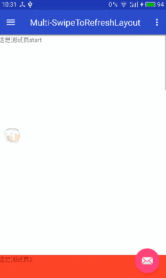
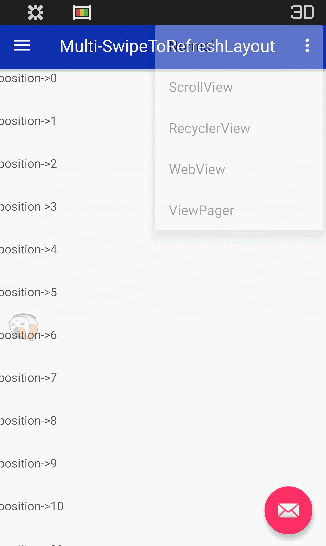
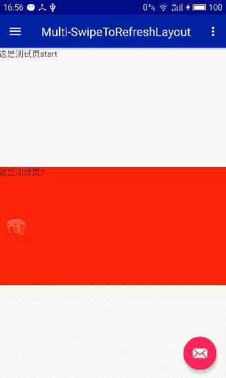
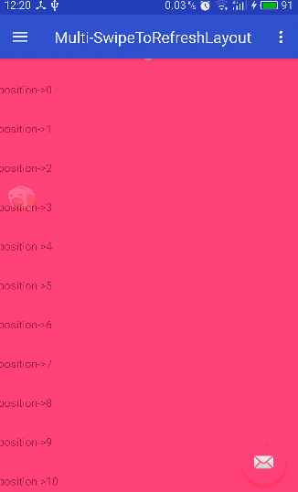

# Multi-SwipeToRefreshLayout
多方向支持刷新布局

## 更新（Update）
_**2017-3-11**_
 * 添加了一个MD风格的header
 * 添加阻尼效果（刷新怎么能少了阻尼呢 o(￣▽￣)d）

_**2017-3-7**_
 * 比较粗糙刷新版提交（效果图），demo暂时用的RecyclerView，细节还未做处理

_**2017-3-3**_
 * 抽屉版提交

_**2017-3-1**_
 * 提交了WebView，ViewPager Demo及效果,准备发布OverScrollLayout，下一版做刷新

_**2017-2-28**_
 * 提交OverScrollLayout，ScrollView版已测试No problem
 * 适配了下普通布局、RecyclerView、WebView、ViewPager（左右），效果都OK

## 关于（About）
初衷（Intention）

-->想要实现一个支持多方向的多功能刷新布局，解决刷新布局在方向上的单一问题
  * 可以OverScroll，可以定制OverScroll状态下显示的布局
  * 可以是抽屉（反正我喜欢显示内容多，菜单没事儿显示那么多干嘛）
  * 可以刷新，可以定制刷新状态下显示的布局

怎么做（How to do）：

考虑到功能有点多，可能毅力不行，拆分下，做成两到三个项目，而且方便维护不是

那么（So）：

事要一件一件做，饭要一口一口吃。

## download
    allprojects {
		repositories {
			...
			maven { url 'https://jitpack.io' }
		}
	}
    -----------------------------------------------------------
    dependencies {
	         compile 'com.github.zhouphenix:Multi-SwipeToRefreshLayout:1.0.1'
	}
## exclude
    compile 'com.android.support:appcompat-v7:25.2.0'

## 使用（Usage）

* OverScrollLayout

        <lib.phenix.com.swipetorefresh.OverScrollLayout xmlns:android="http://schemas.android.com/apk/res/android"
            xmlns:app="http://schemas.android.com/apk/res-auto"
            android:id="@+id/overscroll"
            android:layout_width="match_parent"
            android:layout_height="wrap_content"
            app:bottomView="@layout/layout_horizontal"
            app:contentLayoutId="@+id/scroll" //主布局id
            app:layout_behavior="@string/appbar_scrolling_view_behavior"
            app:leftView="@layout/layout_vertical"
            //app:rightView="@layout/layout_vertical" 空View实现
            app:swipeDirection="left|top|right|bottom"
            app:topView="@layout/layout_horizontal">

            <ScrollView
                android:id="@+id/scroll"
                android:layout_width="match_parent"
                android:layout_height="wrap_content">
            </ScrollView>
        </lib.phenix.com.swipetorefresh.OverScrollLayout>

* SwipeToRefreshLayout

xml中配置

        <lib.phenix.com.swipetorefresh.SwipeToRefreshLayout
            xmlns:android="http://schemas.android.com/apk/res/android"
            xmlns:app="http://schemas.android.com/apk/res-auto"
            android:id="@+id/refresh"
            android:background="@color/colorAccent"
            app:swipeDirection="left|top|right|bottom"
            app:contentLayoutId="@+id/recyclerView"
            app:topView="@layout/layout_horizontal"
            app:bottomView="@layout/layout_horizontal"
            app:rightView="@layout/layout_vertical"
            app:leftView="@layout/layout_vertical"
            android:layout_height="wrap_content"
            android:layout_width="match_parent">
        
            <android.support.v7.widget.RecyclerView
                android:id="@+id/recyclerView"
                android:layout_width="match_parent"
                android:layout_height="match_parent"/>
        </lib.phenix.com.swipetorefresh.SwipeToRefreshLayout>
java中调用，这里仿照QQ写了一个Header、footer分别提供了下拉刷新和上拉加载更多
       
        refresh = (SwipeToRefreshLayout) v.findViewById(R.id.refresh);
                refresh.setTopView(new QQHeader(getActivity()));
                refresh.setOnRefreshCallback(new SwipeToRefreshLayout.OnRefreshCallback() {
                    @Override
                    public void onRefresh(int direction) {
                        refresh.postDelayed(new Runnable() {
                            @Override
                            public void run() {
                                refresh.refreshCompleted();
                            }
                        }, 3000);
                    }
                });
        
                refresh.setBottomView(new LoadMoreFooter(getActivity()));
## 效果

* OverScrollLayout

* 抽屉效果

* 刷新效果

        Copyright 2017 zhouphenix
        
           Licensed under the Apache License, Version 2.0 (the "License");
           you may not use this file except in compliance with the License.
           You may obtain a copy of the License at
        
               http://www.apache.org/licenses/LICENSE-2.0
        
           Unless required by applicable law or agreed to in writing, software
           distributed under the License is distributed on an "AS IS" BASIS,
           WITHOUT WARRANTIES OR CONDITIONS OF ANY KIND, either express or implied.
           See the License for the specific language governing permissions and
           limitations under the License.